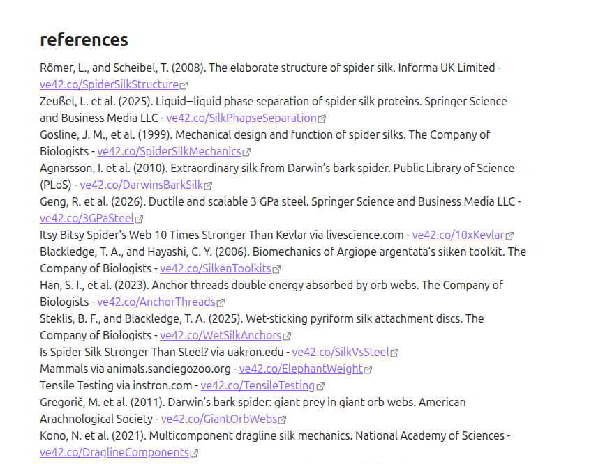
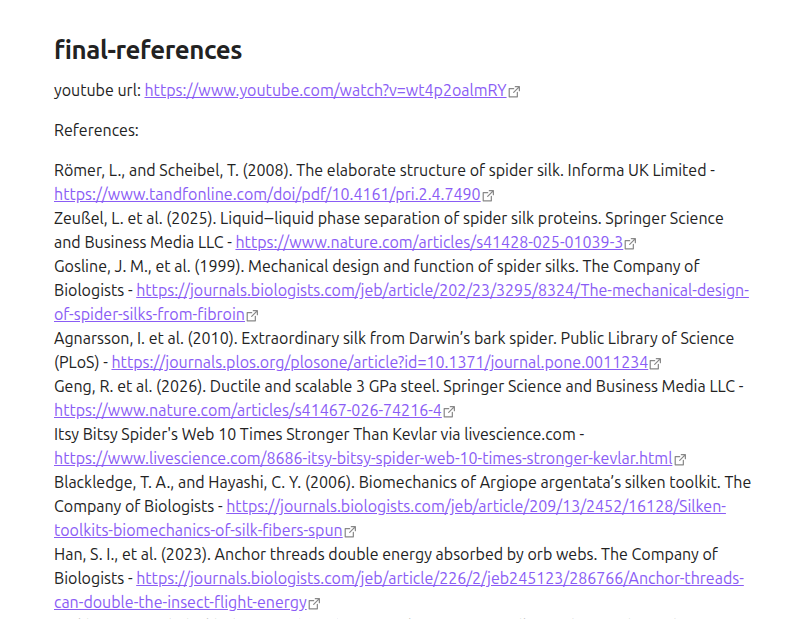
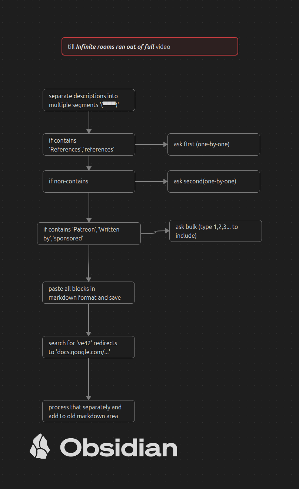

# veritasium-unshort
This repository is a personal attempt to automate the process of converting the shortened URL in the reference document of [veritasium youtube channel](https://www.youtube.com/@veritasium) into their original (redirected) link.

> [!IMPORTANT]  
> This code in this repository is solely created using LLM. So,it is important to aware of before using it
---
<table>
<tr>
<td>

<td></td>
</td>
</tr>
</table>

## Motive
Since the links in the reference list for each veritasium video has put with _https:ve42.co/..._ (their own redirecting domain), it would be **more chance of losing the access to those references in the future due to some reasons**. 

so, I thought that it would be more permanent solution for this problem to convert those shortened links into their original form.

## What you will need to run

- Python 3.12
- Obsidian _(for converting into pdfs)_

## Working
1. After you run the program, it asks for youtube url that you want to get the reference from

2. It fetches the description and put it in JSON file called **description_segments.json**

3. It splits the description of the video into multiple segments

4. It asks which segment you want to include in the final reference Markdown file 

5. It may or may not automatically create a file name related to the video and it will convert those links _(https://ve42.co...)_ into their original form

6. Finally it prompts the user for any modification in the file

7. if yes, it finishes the whole process by converting the MD into PDF file using Obsidian

## Usage 

1. Install **yt_dlp** , **requests** package using pip installer in a folder.

2. Run the _veritasium.py_ file inside the folder using the following command.
`python3.12 veritasium.py`

## Flow design

## License

MIT License
